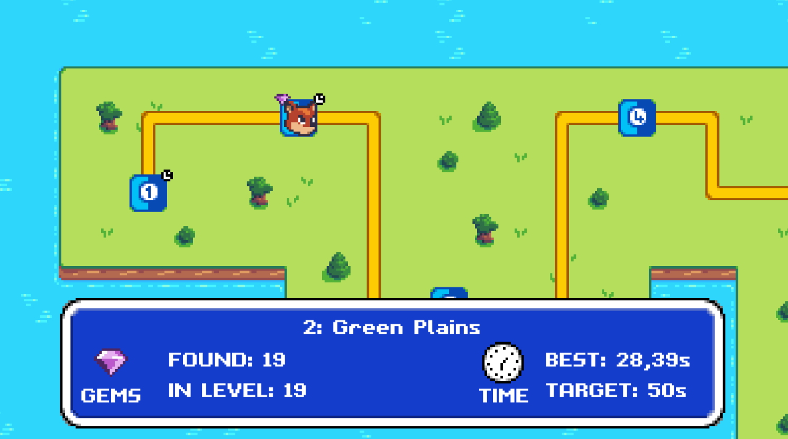

# Welcome to the Platformer Game Documentation

This 2D retro-style platformer game was created in the Unity engine as a final project for the AP8PO course.

## Game Features

- 7 engaging levels
- 3 distinct types of enemies
- Diverse level mechanics including moving platforms, jump pads, and smashers
- Game progress saving functionality
- Convenient pause menu
- An interactive level selector
- Collectible items to enhance gameplay
- Detailed level statistics for tracking progress

## How to Use This Documentation

This documentation contains detailed information about all of the scripts used in our game. Simply navigate to the "Scripts" section in the menu and choose the script you're interested in.

## Authors

The Platformer game was created by [Jan Sáblík](https://github.com/sablikj) and [David Bilnica](https://github.com/dbilnica). Feel free to explore our GitHub profiles to see more of our work!
